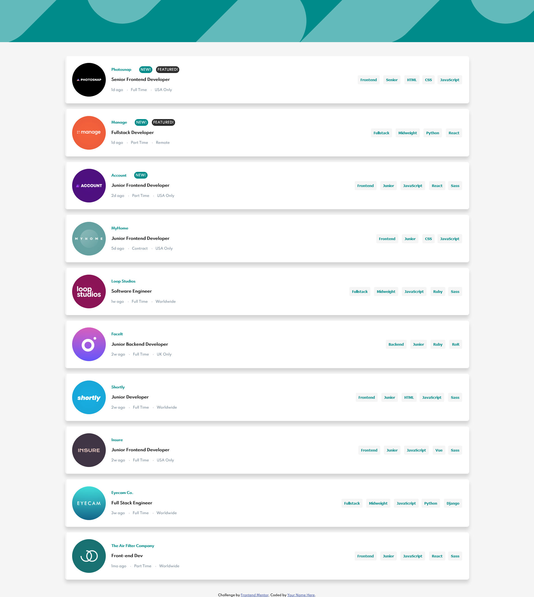
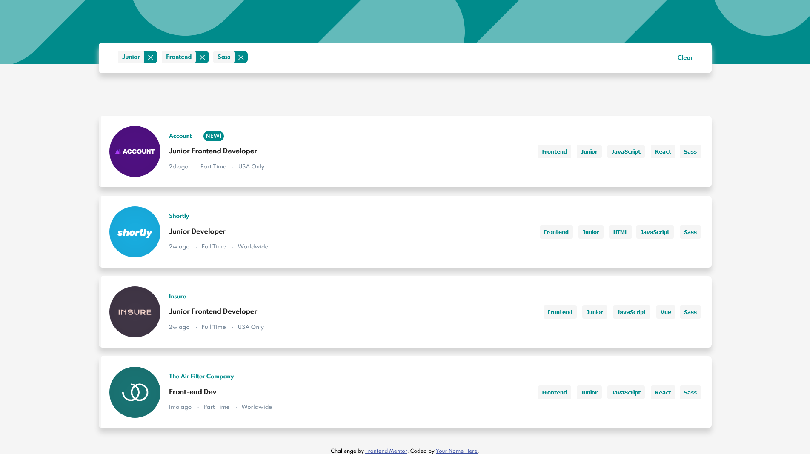

# Frontend Mentor - Job listings with filtering solution

This is a solution to the [Job listings with filtering challenge on Frontend Mentor](https://www.frontendmentor.io/challenges/job-listings-with-filtering-ivstIPCt). Frontend Mentor challenges help you improve your coding skills by building realistic projects. 

## Table of contents

- [Overview](#overview)
  - [The challenge](#the-challenge)
  - [Screenshot](#screenshot)
  - [Links](#links)
- [My process](#my-process)
  - [Built with](#built-with)
  - [What I learned](#what-i-learned)
  - [Continued development](#continued-development)
  - [Useful resources](#useful-resources)
- [Author](#author)
- [Acknowledgments](#acknowledgments)

**Note: Delete this note and update the table of contents based on what sections you keep.**

## Overview

### The challenge

Users should be able to:

- View the optimal layout for the site depending on their device's screen size
- See hover states for all interactive elements on the page
- Filter job listings based on the categories

### Screenshot





### Links

- Solution URL: [https://www.frontendmentor.io/solutions/generated-content-and-filtering-with-javascript-0wA-4bljl]
- Live Site URL: [https://fgil90.github.io/jobListFilter-fgil90/]

## My process

### Built with

- HTML5
- CSS3
- CSS Grid
- Mobile-first workflow
- Javascript

**Note: These are just examples. Delete this note and replace the list above with your own choices**

### What I learned

I learned how to use Template Literals ${} to make my code much better together with the property .innerHTML.

```js
function populateMainDiv() {
    main.innerHTML = '';

    data.forEach(element => {
        let lang = addButtons(element.languages);
        let tools = addButtons(element.tools);        

        let component =
            `<div class="component">
                <div class="logo-container">
                    
                </div>
                <section class="info-left">
                    <em class="company">${element.company}</em>
                    ${element.new ? "<h2 class='new'>NEW!</h2>" : ''}
                    ${element.featured ? "<h2 class='featured'>FEATURED!</h2>" : ''}

                    <h1 class="position">${element.position}</h1>
                    <ul>
                        <li class="postedAt">${element.postedAt}</li>
                        <li class="contract">${element.contract}</li>
                        <li class="location">${element.location}</li>
                    </ul>
                    
                </section>
                <section class="info-right">
                    <button value="role" class="role" onclick="changeFilters(event)">${element.role}</button>
                    <button value="level" class="level" onclick="changeFilters(event)">${element.level}</button>
                    ${lang}
                    ${tools}
                </section>
            </div>`

        main.innerHTML += component;
    });
}
```

### Continued development

I'm very proud of my content generating function, as well as the sorting, as they can deal with any number of objects and filters. I'll try revisiting this challenge in the future to see what could be made more efficiently or if it could have been made in a different way.


## Author

- Website - [Add your name here](https://www.your-site.com)
- Frontend Mentor - [@yourusername](https://www.frontendmentor.io/profile/yourusername)

## Acknowledgments

Thanks to Roger Cardoso for showing me the property .innerHTML which made my code much better. I was using the document.addElement() function before and my code felt too bloated.

